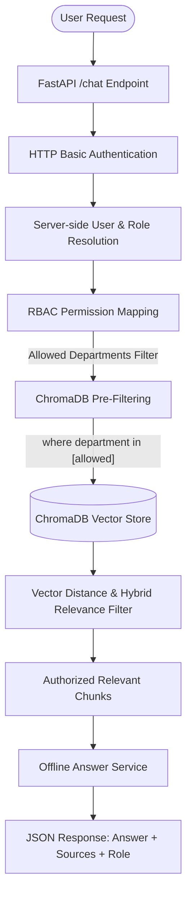

# Internal RAG Chatbot with Role-Based Access Control (RBAC)

> **A secure internal knowledge assistant for retrieving authorized company information using Retrieval-Augmented Generation (RAG), vector similarity search, and backend Role-Based Access Control (RBAC).**

---

## 📌 Project Overview

In enterprise environments, AI chatbots must enforce strict data access boundaries. Providing unfiltered LLM retrieval across company documents risks exposing sensitive financial figures, employee HR files, or proprietary product roadmaps to unauthorized users.

This project implements a **Security-First RAG Pipeline** built on **FastAPI**, **ChromaDB**, and **Sentence-Transformers**. It enforces **Role-Based Access Control (RBAC) pre-filtering BEFORE vector retrieval**, ensuring unauthorized document chunks are excluded prior to similarity distance calculation.

### Current Implementation Status
The project currently operates in an **Offline Retrieval Fallback Mode** (no external LLM API key required). Authorized document chunks are semantically retrieved, validated, and returned with exact source citations.

---

## 🏗️ System Architecture



---

## Key Features

- ⚡ **FastAPI Web Application**: High-performance RESTful server with automated OpenAPI/Swagger documentation (`/docs`).
- 🔐 **Server-Side Authentication & Role Resolution**: HTTP Basic Auth with server-side identity validation in `users_db` (prevents client-side role escalation attacks).
- 🛡️ **Pre-Filtered Vector Retrieval**: Applies ChromaDB metadata filters (`where={"department": {"$in": [...]}}`) *before* similarity search execution.
- 📦 **Multi-Format Document Ingestion**: Ingests Markdown (`.md`), Text (`.txt`), and CSV (`.csv`) files from `resources/data/`.
- 🔒 **Sensitive HR Field Redaction**: Excludes sensitive attributes (such as `salary`) during CSV parsing to prevent data leakage.
- 🧠 **Local Dense Embeddings**: Embeds chunks using `sentence-transformers/all-MiniLM-L6-v2` locally without external API costs.
- 💾 **Persistent Vector Indexing**: Stores ~437 document chunks in a persistent ChromaDB store (`chroma_db/`) with deterministic `chunk_id` upsert deduplication.
- 🎯 **Hybrid Relevance Validation**: Combines vector cosine distance (`<= 0.75`) with core domain term verification to eliminate generic word false positives.
- 📝 **Source Attribution**: Returns clean, deduplicated file path citations (e.g. `["engineering/engineering_master_doc.md"]`).
- 🧪 **Automated Verification Suite**: Comprehensive test suite covering ingestion (`test_phase2b.py`), vector persistence (`test_phase2c.py`), RBAC pre-filtering (`test_phase2d.py`), and end-to-end `/chat` security (`test_phase2e.py`).

---

## 🔒 Role-Based Permission Matrix

Each authenticated role has strict department folder permissions:

| User Role | Permitted Department Folders | Restricted Folders |
| :--- | :--- | :--- |
| `engineering` | `engineering/`, `general/` | `finance/`, `hr/`, `marketing/` |
| `finance` | `finance/`, `general/` | `engineering/`, `hr/`, `marketing/` |
| `hr` | `hr/`, `general/` | `engineering/`, `finance/`, `marketing/` |
| `marketing` | `marketing/`, `general/` | `engineering/`, `finance/`, `hr/` |
| `general` | `general/` | `engineering/`, `finance/`, `hr/`, `marketing/` |

> *Note: General company policy documents (`general/employee_handbook.md`) are accessible to all authenticated users.*

---

## 📁 Repository Structure

```
ds-rpc-01/
├── app/
│   ├── __init__.py
│   ├── main.py                 # FastAPI application, auth dependency, endpoints
│   ├── schemas/
│   │   └── chat.py             # Pydantic request/response schemas
│   ├── services/
│   │   ├── rbac_service.py     # Role permission mapping
│   │   ├── document_service.py # Document loader, chunker, & sensitive field filter
│   │   ├── vector_service.py   # Persistent ChromaDB client & vector operations
│   │   ├── rag_service.py      # Pre-filtered vector retrieval engine
│   │   ├── answer_service.py   # Offline fallback answer formatter
│   │   └── search_service.py   # Keyword fallback search service
│   └── utils/
├── chroma_db/                  # Persistent ChromaDB vector database files
├── resources/
│   └── data/                   # Departmental knowledge base
│       ├── engineering/        # engineering_master_doc.md
│       ├── finance/            # financial_summary.md, quarterly_financial_report.md
│       ├── general/            # employee_handbook.md
│       ├── hr/                 # hr_data.csv (sensitive fields redacted)
│       └── marketing/          # 5 quarterly & annual marketing reports
├── tests/
│   ├── test_phase2b.py         # Document chunking & metadata test
│   ├── test_phase2c.py         # Vector store persistence & deduplication test
│   ├── test_phase2d.py         # RBAC pre-filtering security test
│   └── test_phase2e.py         # End-to-end RAG /chat API security test
├── .env.example                # Environment variables template
├── .gitignore
├── pyproject.toml              # Project metadata & dependencies
└── README.md
```

---

## 🛠️ Getting Started

### 1. Prerequisites
- **Python**: `>= 3.10`
- **PowerShell / Terminal**

### 2. Environment Setup & Dependency Installation

Clone the repository and activate your virtual environment:

```powershell
# Clone the repository
git clone https://github.com/Kavinsharvesh/internal-rag-chatbot-rbac.git
cd internal-rag-chatbot-rbac

# Activate virtual environment (Windows PowerShell)
.\.venv\Scripts\Activate.ps1

# Install required dependencies
python -m pip install "fastapi[standard]>=0.115.12" "chromadb>=0.5.0" "sentence-transformers>=3.0.0" "python-dotenv>=1.0.0"
```

---

## 🚀 Running the FastAPI Application

Start the development server:

```powershell
python -m fastapi dev app/main.py
```

- **Server URL**: `http://127.0.0.1:8000`
- **Swagger Documentation**: `http://127.0.0.1:8000/docs`

---

## 💡 API Usage Examples

### Test Accounts (HTTP Basic Auth)

| Username | Password | Role |
| :--- | :--- | :--- |
| `Tony` | `password123` | `engineering` |
| `Sam` | `financepass` | `finance` |
| `Natasha` | `hrpass123` | `hr` |
| `Bruce` | `securepass` | `marketing` |

### 1. Authorized Engineering Query (User: `Tony`)
```powershell
curl -u Tony:password123 -X POST "http://127.0.0.1:8000/chat" `
     -H "Content-Type: application/json" `
     -d '{"message": "architecture overview"}'
```
**Response**:
```json
{
  "query": "architecture overview",
  "answer": "Offline retrieval fallback: I found relevant information in the authorized company documents.\n\nRelevant excerpts:\n[Excerpt 1 from engineering/engineering_master_doc.md]:\n# FinSolve Technologies Engineering Document...",
  "sources": [
    "engineering/engineering_master_doc.md"
  ],
  "role": "engineering",
  "status": "success"
}
```

### 2. Unauthorized Query Attempt (User: `Tony` requesting Finance information)
```powershell
curl -u Tony:password123 -X POST "http://127.0.0.1:8000/chat" `
     -H "Content-Type: application/json" `
     -d '{"message": "quarterly revenue report"}'
```
**Response**:
```json
{
  "query": "quarterly revenue report",
  "answer": "No relevant information was found in the authorized company documents.",
  "sources": [],
  "role": "engineering",
  "status": "no_results"
}
```
*(Pre-filtering restricts ChromaDB to `engineering` and `general` folders. Zero finance documents are retrieved).*

---

## 🧪 Running Automated Tests

Run the full test suite from your terminal:

```powershell
# Phase 2B: Document processing & sensitive HR field protection test
python tests/test_phase2b.py

# Phase 2C: Persistent ChromaDB vector store & deduplication test
python tests/test_phase2c.py

# Phase 2D: Secure RBAC pre-filtered vector retrieval test
python tests/test_phase2d.py

# Phase 2E: End-to-end RAG /chat API test (Security, auth, escalation checks)
python tests/test_phase2e.py
```

---

## 🛣️ Future Roadmap

- 🤖 **LLM Answer Synthesis**: Integration with Google Gemini / OpenAI SDKs for natural conversational summaries.
- 🛡️ **AI Guardrails**: Topic validation and prompt-injection safety controls.
- 📊 **Monitoring & Telemetry**: Retrieval metrics, response latency, and usage tracking.
- 💻 **Interactive UI**: Streamlit web interface for enterprise chat interaction.

---

## 📜 License

Distributed under the MIT License.
