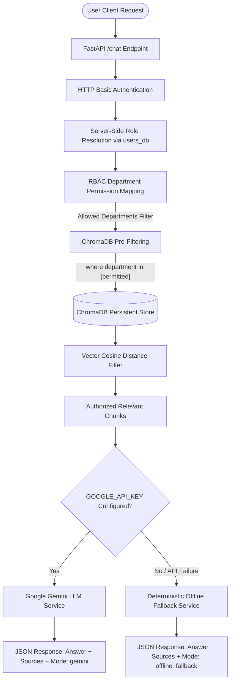

# Internal RAG Chatbot with Role-Based Access Control (RBAC)

> **A security-focused RAG chatbot prototype enforcing Role-Based Access Control (RBAC) BEFORE vector retrieval, powered by FastAPI, ChromaDB, Sentence Transformers, and Google Gemini API.**

---

## 📌 1. Project Overview

In corporate environments, AI assistants must respect strict data access boundaries. Unfiltered retrieval over enterprise knowledge bases risks leaking sensitive financial figures, confidential HR records, or strategic product roadmaps to unauthorized employees.

This project implements a **Security-First RAG Pipeline** that enforces **Role-Based Access Control (RBAC) pre-filtering BEFORE vector similarity retrieval**. Documents are tagged with department metadata upon ingestion. When a user queries the chatbot, their identity and role are resolved strictly on the server. ChromaDB applies metadata filters prior to vector search, ensuring unauthorized document chunks are never exposed or sent to the LLM.

Natural-language answers are generated using **Google Gemini API** (`google-genai`). If an API key is unconfigured or unavailable, the system cleanly degrades to a deterministic **Offline Retrieval Fallback Mode** without crashing or leaking data.

---

## 🏗️ 2. System Architecture



---

## ⚡ 3. Key Features

- 🚀 **FastAPI REST API**: High-performance async web framework with automated OpenAPI/Swagger interactive documentation (`/docs`).
- 🔐 **Server-Side Authentication**: HTTP Basic Authentication with server-side identity validation in `users_db` (blocks client-side role escalation payloads).
- 🛡️ **Pre-Vector RBAC Filtering**: Enforces metadata filters (`where={"department": {"$in": [...]}}`) *before* similarity search execution.
- 📦 **Multi-Format Document Ingestion**: Parses Markdown (`.md`), Plain Text (`.txt`), and CSV (`.csv`) documents from `resources/data/`.
- 🔒 **Sensitive HR Field Redaction**: Excludes sensitive CSV attributes (such as `salary`) during parsing to prevent data leakage.
- 🧠 **Local Dense Embeddings**: Embeds document chunks using `sentence-transformers/all-MiniLM-L6-v2` locally with zero external latency or API costs.
- 💾 **Persistent Vector Storage**: Stores ~437 document chunks in a persistent ChromaDB database (`chroma_db/`) with deterministic `chunk_id` deduplication.
- 🤖 **Google Gemini API Integration**: Synthesizes natural-language answers using the official `google-genai` SDK (`gemini-3.6-flash`, `gemini-3.5-flash`) with grounded prompt injection safeguards.
- 🔄 **Graceful Offline Fallback**: Degrades automatically to deterministic chunk retrieval if Gemini API is unconfigured or unreachable.
- 🧪 **Pytest Automated Test Suite**: 100% passing test suite (`pytest`) covering document ingestion, vector persistence, RBAC filtering, FastAPI integration, and Gemini synthesis safety.

---

## 🔒 4. Security & RBAC Workflow

### Role-Based Permission Matrix

Each authenticated role has explicit access boundaries:

| User Role | Permitted Department Folders | Restricted Folders |
| :--- | :--- | :--- |
| `engineering` | `engineering/`, `general/` | `finance/`, `hr/`, `marketing/` |
| `finance` | `finance/`, `general/` | `engineering/`, `hr/`, `marketing/` |
| `hr` | `hr/`, `general/` | `engineering/`, `finance/`, `marketing/` |
| `marketing` | `marketing/`, `general/` | `engineering/`, `finance/`, `hr/` |
| `general` | `general/` | `engineering/`, `finance/`, `hr/`, `marketing/` |

> *Note: General company documents (`general/employee_handbook.md`) are accessible to all authenticated roles.*

### Security Safeguards

1. **Server-Side Identity Trust**: Client payloads containing `role` parameters are ignored. Role resolution is derived strictly from the authenticated Basic Auth user on the server.
2. **Pre-Retrieval Metadata Filter**: Vector similarity search is constrained to permitted department folders before vector distance calculation.
3. **Prompt Injection Safeguards**: Retrieved context is supplied to Gemini as untrusted data with strict system instructions prohibiting role discussions, hallucination, or context escape.
4. **API Key Secrecy**: `GOOGLE_API_KEY` is loaded strictly via `python-dotenv` from `.env` (ignored by Git) and is never printed, logged, or returned in API responses.

---

## 📁 5. Project Folder Structure

```
ds-rpc-01/
├── app/
│   ├── __init__.py
│   ├── main.py                 # FastAPI application, auth dependency, & /chat endpoint
│   ├── schemas/
│   │   └── chat.py             # Pydantic request & response models (mode: gemini vs offline_fallback)
│   ├── services/
│   │   ├── rbac_service.py     # Role-to-department permission mapping
│   │   ├── document_service.py # Document loader, chunker, & sensitive field filter
│   │   ├── vector_service.py   # Persistent ChromaDB client & vector search engine
│   │   ├── rag_service.py      # Pre-filtered vector retrieval service
│   │   ├── llm_service.py      # Google Gemini API service with prompt safeguards
│   │   ├── answer_service.py   # Answer synthesis coordinator (Gemini vs Offline Fallback)
│   │   └── search_service.py   # Keyword search service
│   └── utils/
├── chroma_db/                  # Generated locally; persistent vector store (ignored by Git)
├── resources/
│   └── data/                   # Knowledge base documents
│       ├── engineering/        # engineering_master_doc.md
│       ├── finance/            # financial_summary.md, quarterly_financial_report.md
│       ├── general/            # employee_handbook.md
│       ├── hr/                 # hr_data.csv (sensitive fields redacted)
│       └── marketing/          # quarterly & annual marketing reports
├── tests/
│   ├── test_phase2b.py         # Document chunking & metadata test
│   ├── test_phase2c.py         # ChromaDB persistence & deduplication test
│   ├── test_phase2d.py         # Secure RBAC pre-filtering test
│   ├── test_phase2e.py         # End-to-end FastAPI RAG /chat test
│   └── test_phase2f.py         # Google Gemini integration & secrecy test
├── .env.example                # Environment variables template
├── .gitignore                  # Git ignore rules (includes .env & chroma_db/)
├── pyproject.toml              # Project metadata & dependencies
└── README.md                   # Project documentation
```

---

## 🛠️ 6. Setup Instructions

### Prerequisites
- **Python**: `>= 3.10`
- **PowerShell / Terminal**

### Installation

Clone the repository and set up a virtual environment:

```powershell
# 1. Clone the repository
git clone https://github.com/Kavinsharvesh/internal-rag-chatbot-rbac.git
cd internal-rag-chatbot-rbac

# 2. Create virtual environment
python -m venv .venv

# 3. Activate virtual environment (Windows PowerShell)
.\.venv\Scripts\Activate.ps1

# 4. Install project dependencies
python -m pip install -e .
```

---

## 🔑 7. Environment Variable Setup

1. Copy `.env.example` to create your local `.env` file:
   ```powershell
   Copy-Item .env.example .env
   ```

2. Open `.env` and add your Google Gemini API key:
   ```env
   GOOGLE_API_KEY=your_actual_gemini_api_key_here
   CHROMA_DB_DIR=chroma_db
   ```

> ⚠️ **Security Note**: Never commit `.env` to version control. `.env` is already included in `.gitignore`.

---

## 🚀 8. How to Run the Application

Start the FastAPI development server:

```powershell
python -m fastapi dev app/main.py
```

- **Server URL**: `http://127.0.0.1:8000`
- **Interactive Documentation**: `http://127.0.0.1:8000/docs`

---

## 🧪 9. How to Run Tests

Run the complete test suite using **pytest**:

```powershell
python -m pytest -v tests/
```

You can also run individual phase tests directly:

```powershell
python tests/test_phase2b.py  # Ingestion & metadata
python tests/test_phase2c.py  # Vector persistence & deduplication
python tests/test_phase2d.py  # RBAC pre-vector filtering
python tests/test_phase2e.py  # End-to-end FastAPI endpoint
python tests/test_phase2f.py  # Gemini LLM integration & safety
```

---

## 💡 10. Example API Request and Response

### Test User Credentials

| Username | Role | Permitted Access |
| :--- | :--- | :--- |
| `Tony` | `engineering` | `engineering/`, `general/` |
| `Sam` | `finance` | `finance/`, `general/` |
| `Natasha` | `hr` | `hr/`, `general/` |
| `Bruce` | `marketing` | `marketing/`, `general/` |

---

### Example 1: Authorized Engineering Query (`Tony`)

**Request**:
```powershell
curl -u USERNAME:PASSWORD -X POST "http://127.0.0.1:8000/chat" `
     -H "Content-Type: application/json" `
     -d '{"message": "architecture overview"}'
```

**Response** (`mode: "gemini"`):
```json
{
  "query": "architecture overview",
  "answer": "Based on `engineering/engineering_master_doc.md`, FinSolve's architecture is a microservices-based, cloud-native system designed for scalability, resilience, and security. It leverages a modular design to support rapid feature development and seamless integration with third-party financial systems...",
  "sources": [
    "engineering/engineering_master_doc.md"
  ],
  "role": "engineering",
  "status": "success",
  "mode": "gemini"
}
```

---

### Example 2: Unauthorized Cross-Department Attempt (`Tony` requesting Finance)

**Request**:
```powershell
curl -u USERNAME:PASSWORD -X POST "http://127.0.0.1:8000/chat" `
     -H "Content-Type: application/json" `
     -d '{"message": "quarterly revenue report"}'
```

**Response**:
```json
{
  "query": "quarterly revenue report",
  "answer": "No relevant information was found in the authorized company documents.",
  "sources": [],
  "role": "engineering",
  "status": "no_results",
  "mode": "offline_fallback"
}
```
*(ChromaDB pre-filtering restricts retrieval to `engineering` and `general` folders. Zero finance documents are retrieved, and Gemini is NOT called).*

---

## 🛣️ 11. Limitations & Future Improvements

- 💬 **Multi-Turn Conversation Memory**: Current implementation evaluates single-turn queries; adding session history tracking will support conversational context.
- 🛡️ **Advanced AI Guardrails**: Integrating Llama-Guard or NeMo Guardrails for input prompt sanitization and topic enforcement.
- 📊 **Observability & Telemetry**: Adding OpenTelemetry tracing for vector latency and Gemini token usage monitoring.
- 💻 **Web Interface**: Developing a Streamlit or React frontend for interactive corporate use.
